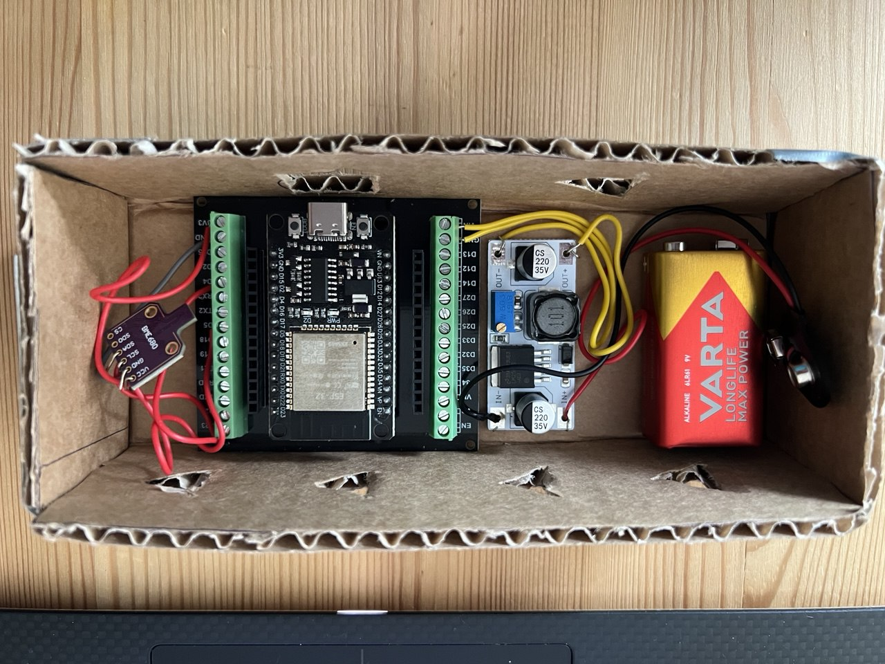
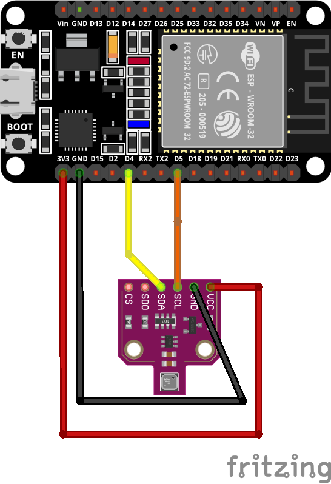
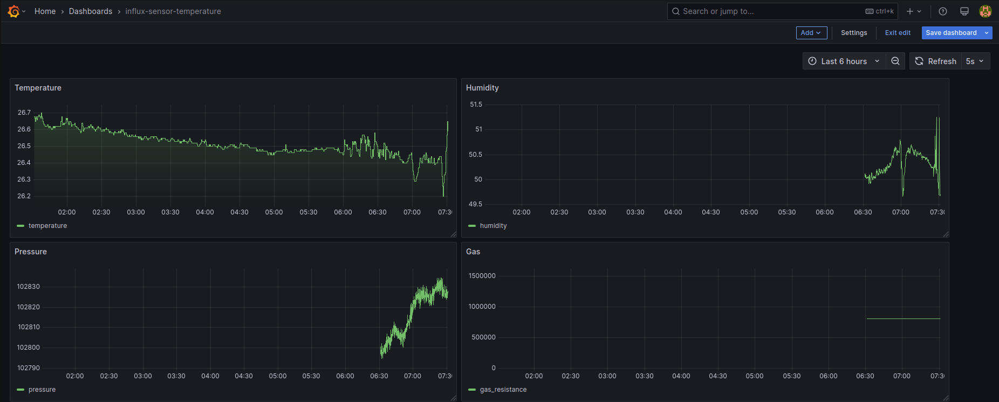

# ESP32 + BME680 IoT Sensor Project

## Overview

This project is an end-to-end IoT system using an ESP32 microcontroller and a BME680 environmental sensor to capture real-time temperature, humidity, pressure, and gas resistance data. The data is transmitted over Wi-Fi to a Flask-based Python backend server. The server stores the data in both SQLite and InfluxDB databases and visualizes it in real time through Grafana.

<p align="center">

<br>
  <em>Fig 1: ESP32 + BME680 Wiring</em>
</p>

---

## Components

### Hardware

- **ESP32 Dev Board**
- **BME680 Sensor** (connected via I<sup>2</sup>C)
- **Jumper wires**
- **USB cable for programming**

### Software Stack

- **ESP-IDF (C)** for embedded development
- **Flask (Python)** for server-side API
- **SQLite** for local persistence
- **InfluxDB** for time-series data storage
- **Grafana** for real-time dashboard visualization

---

## Features

- Periodic sensor data capture (temperature, humidity, pressure, gas resistance)
- JSON-formatted data sent over HTTP to backend server
- Dual database logging: SQLite and InfluxDB
- Real-time data visualization in Grafana
- Modular and clean backend structure with error handling

---

## How It Works

### 1. ESP32

- Connects to Wi-Fi using credentials from `wifi_config.h`
- Reads sensor data from BME680
- Sends data every 5 seconds to Flask server via HTTP

<p align="center">

<br>
  <em>Fig 2: ESP32 + BME680 Wiring Diagram from Fritzing</em>
</p>

### 2. Flask Server

- Exposes `/sensor` endpoint to receive JSON
- Stores data in SQLite
- Writes data to InfluxDB bucket using `influxdb-client` SDK
- Provides `/latest` endpoint to return the most recent row

### 3. InfluxDB + Grafana

- InfluxDB stores time-series data
- Grafana queries InfluxDB via Flux to create dashboards
- Panels created for temperature, humidity, pressure, and gas resistance

<p align="center">

<br>
  <em>Fig 3: Grafana screenshot</em>
</p>

---

## Challenges Faced & Solutions

### 1. **ESP32 Not Connecting to Host PC**

- **Issue**: USB serial port disappeared right after plugging in
- **Cause**: `brltty` service was hijacking the serial device
- **Solution**: Disabled `brltty` via  
  `sudo systemctl disable brltty && sudo systemctl stop brltty`

### 2. **Flask ImportError with `token.py`**

- **Issue**: Naming a file `token.py` conflicted with Python stdlib `token` module
- **Solution**: Renamed to `influx_token.py`

### 3. **Grafana Cannot Connect to InfluxDB**

- **Issue**: Grafana shows connection refused when using `http://localhost:8086`
- **Cause**: Grafana runs in Docker and cannot access host's localhost
- **Solutions**: Used `--network host` when running Grafana in Docker (Linux)

---

## To Run the System

### 1. Start Flask Server

```bash
python3 server/server.py
```

### 2. Start InfluxDB and Grafana (Docker)

```bash
docker start influxdb
docker run -d --name grafana --network host grafana/grafana-oss
```

### 3. Run ESP32 Firmware

```bash
idf.py build && idf.py -p /dev/ttyUSB0 flash monitor
```

---

## Optional Enhancements

- To run on battery, instead of USB connection

- ✅ HTTPS, and OTA firmware update support

---
